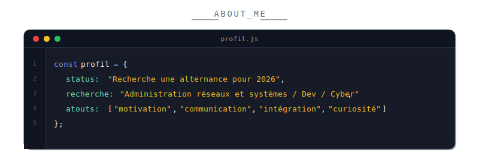
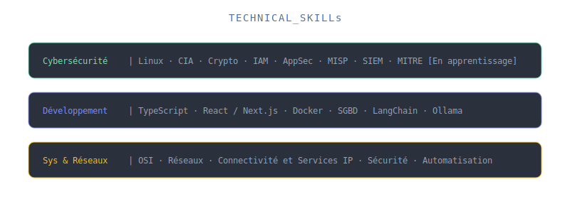
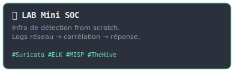
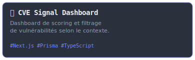
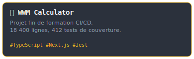
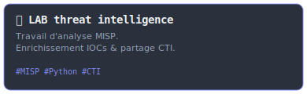
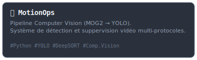
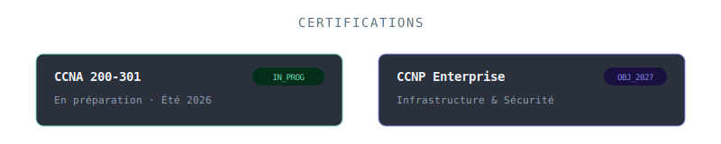
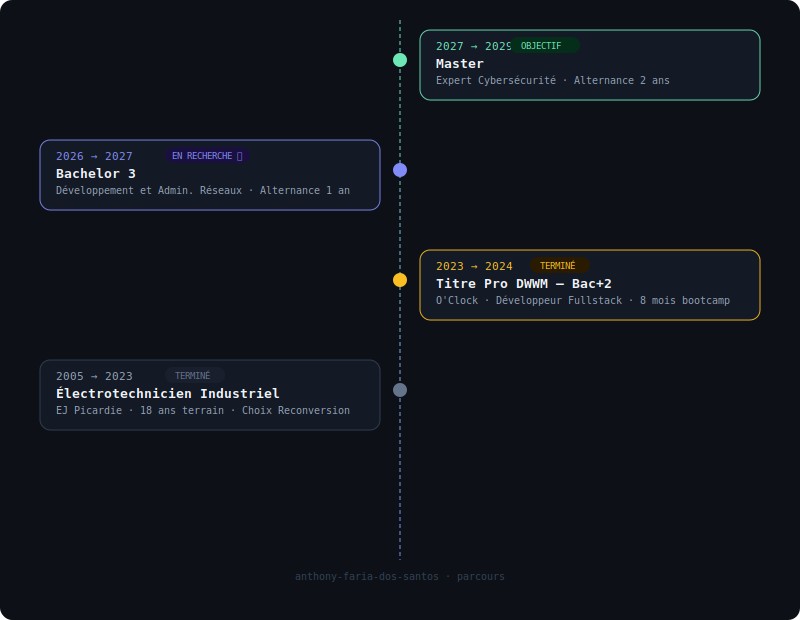

  
<!-- HEADER -->

<!-- BADGES SOCIAUX -->

&nbsp;

&nbsp;

&nbsp;

<picture>
  <source media="(prefers-color-scheme: dark)" srcset="https://raw.githubusercontent.com/Anthony-Faria-dos-santos/Anthony-Faria-dos-santos/output/github-contribution-grid-snake-dark.svg"/>
  
</picture>

 

<!-- A PROPOS & STACK -->

  

 
 

<!-- PROJETS (Grille 2x2 cliquable) -->

 
<h3 align="center" style="font-family: monospace; color: #64748b; letter-spacing: 2px;">PROJECTS</h3>
 

  

<!-- CERTIFICATIONS & TIMELINE -->

 
<h3 align="center" style="font-family: monospace; color: #64748b; letter-spacing: 2px;">PARCOURS</h3>
 

 
 

<!-- STATS GITHUB (Theme Tokyonight) -->

 
 

 
 

 

